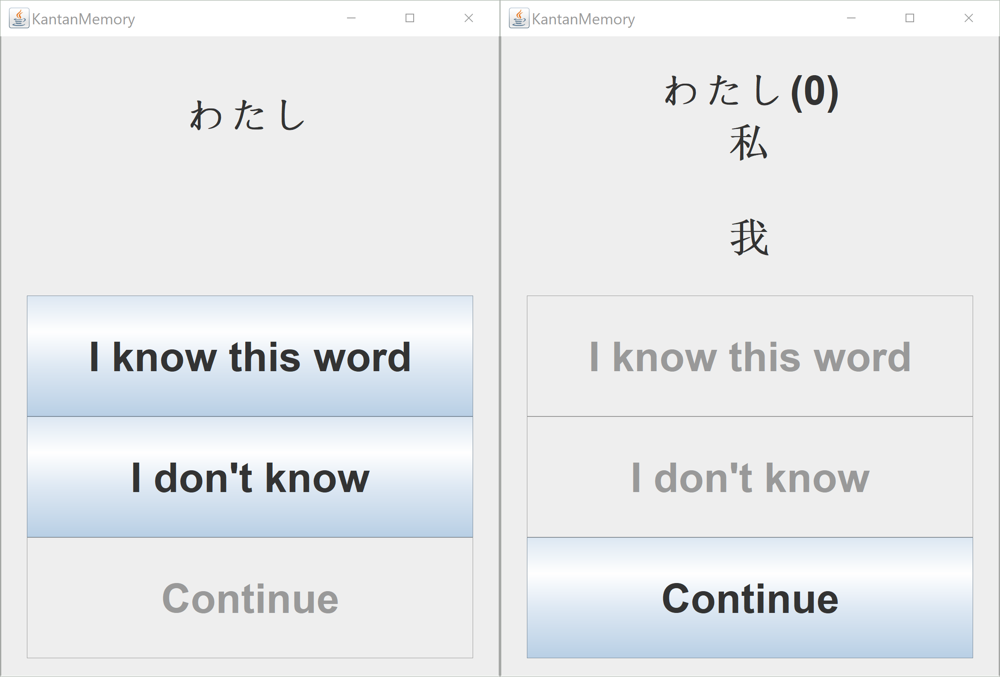
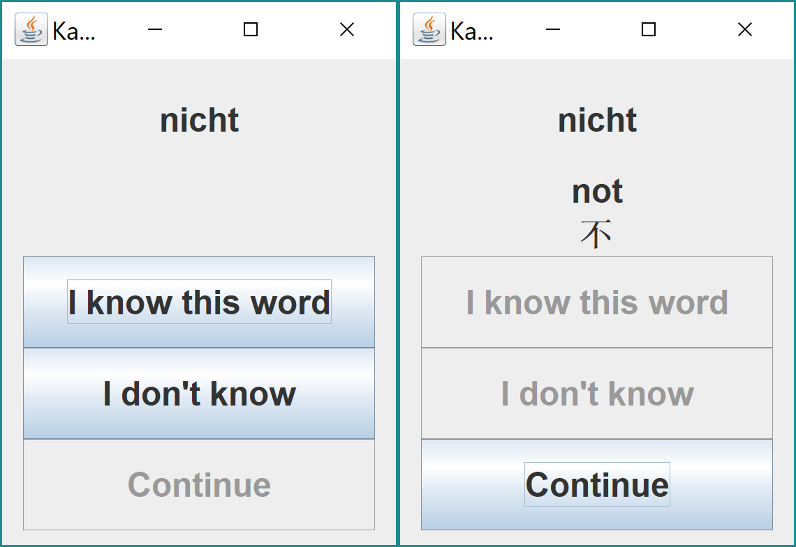

# KantanMemory 

KantanMemory can help you learn the Japanese language or any language you want with ease.
"Kantan" is the romaji of 簡単 (かんたん) in Japanese, meaning "easy".

## Outline

Platforms:
- Any platform supporting JVM
- Web (planned)

License: MIT

### Features
- Modes:
  - Recall Mode - try to recall the word meaning
     - Display words in kana (仮名)
     - Gradually give hints such as kanji (漢字)
  - Match Mode - match word with correct meaning (planned)
  - Spell Mode (planned)
- Use the Ebbinghaus forgetting curve to generate daily learning lists
- Customizable word lists
- Pronounce the word (planned)
  - Japanese text-to-speech
- Sync learning data to the cloud (planned)

### Screenshots
Learning Japanese:

Learning German:

## Development plan
### Resources
- Default word lists for the Japanese language
  - Stored as CSV files

### Dependencies
- YAML parser
  - SnakeYAML
- CSV parser
- JUnit

### Components
#### Core components
- Daily learning list generator
  - Wordlist generated consists of two parts:
    - New words
      - User can specify the number of words to learn everyday
      - Default word lists provided in the app
      - User can choose which word list to add new words from
    - Old words to revise
      - Selected from previous learning data, according to forgetting curve algorithm
- Process manager
  - Manage every individual word
    - Based on how familiar the user is with an individual word, decides:
      - Should the user memorize the word again later
      - The new familiarity of that word
  - Manage the list of unrecognized words
    - Add the user's unrecognized words back to today's learning list

##### Data-related components
- Data reader
  - Read default word list CSV files from the package
  - Read the user learning data of old words
- Data writer
  - Save config to the config file
  - Store learning data in YAML format

#### UI components
- GUI

### Data

#### User learning data
Format: YAML

Includes:
- List of words that the user has learned
  - Each word in the list records the following data:
    - ID of the word
    - The date of last time the user has encountered that word
    - The number of times the user has encountered that word
    - User's familiarity level to the word

#### Custom learning resources
- Customizable wordlist
  - User can add their own word lists

### Configuration
Format: YAML

Includes:
- Progresses of each word list
- Current word list chosen

### Terminologies
- Word list: a list consist of words, each with its writing form, kana pronunciation form and stress number.
  - Daily learning list: the list of words that the user need to memorize in a single day.
  - Default wordlist: the wordlist packed with the software, the new words in the daily wordlist will be from this list if not otherwise configured.
     - Default wordlist: word lists packed with the software.
     - Custom wordlist: word lists created by the user themself.
- (Memorizing) process: in a daily word memorizing process, user need to go over each word in the daily learning list.
- Familiar/known/recognized: user believes they know this word. If confirmed, the word will no longer appear later in the daily learning list.
